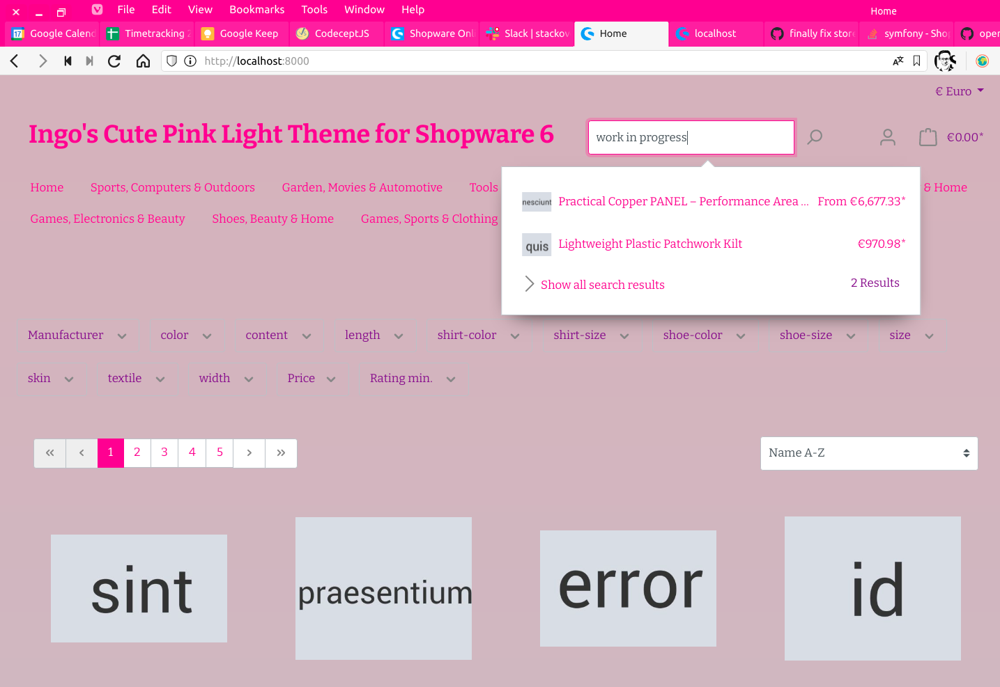

[Ingo's Cute Pink Light Theme for Shopware 6](https://github.com/openmindculture/IngoSCutePinkLightTheme) is a simple, but not your ordinary, Shopware 6 storefront theme, inspired by my [Cute Pink Light Theme for IntelliJ IDEA and PhpStorm](https://github.com/openmindculture/intellij-cute-pink-light-theme) (which was inspired by [a theme for VisualStudio Code](https://marketplace.visualstudio.com/items?itemName=webfreak.cute-theme)), and following my educational [IngoSFraktalistheme Demo Theme for Shopware 6](https://github.com/openmindculture/IngoSFraktalistheme) (which I build after following various Shopware plugin tutorials, most notably the official [Shopware 6 - Developer Training Basic](https://academy.shopware.com/courses/take/shopware-6-developer-training-english/) with Niklas Dzösch.

This theme will be available in the official Shopware store soon after it has eventually been finished. Here is a screenshot of an early proof-of-concept demo version:

## Installation

Install and activate as a plugin or upload and choose as a theme.

## Development

Check out this repository in a Shopware 6 development setup like [shopware/development](https://github.com/shopware/development) or [openmindculture/fractal-shopware-demo](https://github.com/openmindculture/fractal-shopware-demo)

into
`/development/custom/plugins`

and open the development repository as project root in your IDE (e.g. PhpStorm + Symfony and Shopware plugins).
